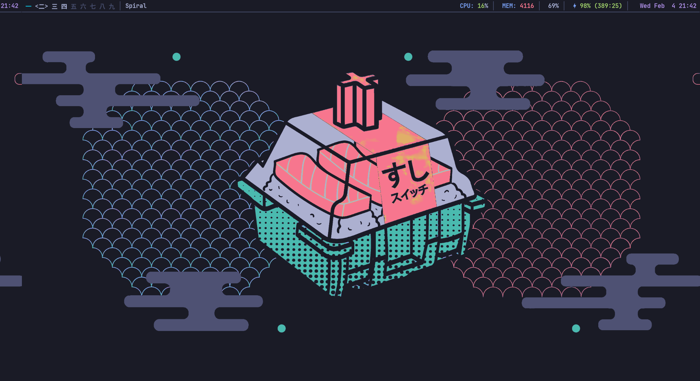
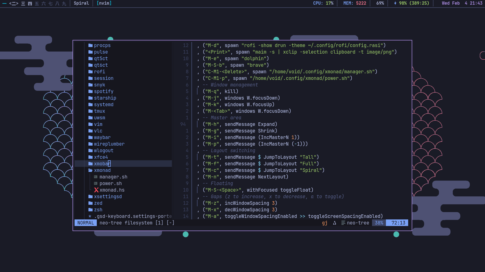
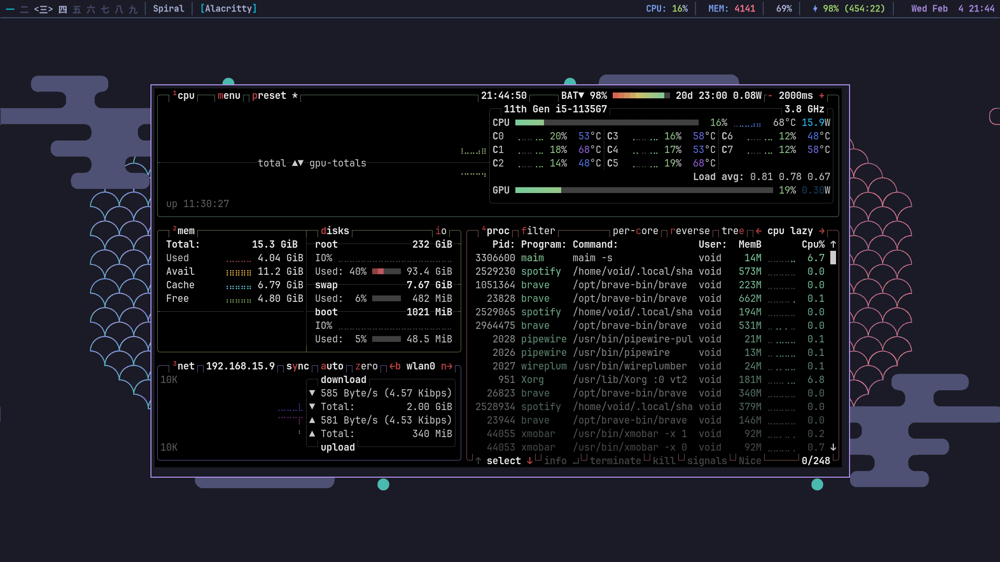

# Dotfiles - Minimalist XMonad Setup

A clean, efficient, and minimalist desktop environment configuration centered around **XMonad** window manager. This setup emphasizes keyboard-driven workflows, minimalism, and productivity with a beautiful TokyoNight color scheme.

## Overview

This dotfiles repository contains my personal Linux desktop configuration built on:

- **Window Manager**: [XMonad](https://xmonad.org/) - A dynamically tiling window manager written in Haskell
- **Status Bar**: [XMobar](https://codeberg.org/xmobar/xmobar) - A minimal status bar for XMonad
- **Terminal**: [Alacritty](https://alacritty.org/) - Fast, GPU-accelerated terminal emulator
- **Launcher**: [Rofi](https://davatorium.github.io/rofi/) - Window switcher, application launcher
- **Theme**: TokyoNight - Modern, eye-pleasing color palette
- **Philosophy**: Keyboard-first, distraction-free, keyboard-driven workflow

## Visual Preview


*XMonad Spiral layout showcasing the elegant sushi wallpaper and TokyoNight theme*



*Editing xmonad.hs configuration with Neovim, showing file explorer and keybindings*



*Alacritty terminal Btop displaying system resources with CPU, memory, network, and disk monitoring*

## Philosophy

This setup follows minimalist principles:

✨ **Keyboard-Driven** - Minimize mouse usage; everything accessible via keyboard shortcuts  
✨ **Lightweight** - No bloat, just essential tools that work efficiently  
✨ **Fast** - Optimized for performance on modern hardware  
✨ **Productive** - Designed to minimize context switching and maximize focus  
✨ **Beautiful** - Aesthetically pleasing without sacrificing functionality  

## Directory Structure

```
dotfiles/
├── xmonad/              # XMonad window manager configuration
│   ├── xmonad.hs        # Main XMonad configuration (Haskell)
│   ├── manager.sh       # Window/system manager helper
│   └── power.sh         # Power management script (logout/reboot/shutdown)
├── xmobar/              # XMobar status bar configuration
│   └── xmobarrc         # XMobar config with CPU, memory, volume, battery
├── alacritty/           # Terminal emulator configuration
│   └── alacritty.toml   # Alacritty settings (colors, fonts, keybindings)
├── rofi/                # Application launcher configuration
│   ├── config.rasi      # Main Rofi configuration
│   └── tokyonight.rasi  # TokyoNight theme for Rofi
├── nvim/                # Neovim editor configuration
│   ├── init.lua         # Main Neovim config
│   ├── health-check.lua # Health check plugin
│   └── treesitter-config.lua # Treesitter language parsing
├── tmux/                # Tmux multiplexer configuration
│   └── tmux.conf        # Tmux keybindings and options
├── scripts/             # Utility scripts
│   └── install.sh       # Installation and setup script
└── LICENSE
```

## Key Features

### XMonad Window Manager

**Minimalist Tiling Layouts:**
- **Tall** (Default) - Master-stack layout with resizable master area
- **Wide** (Mirror Tall) - Master area on top, stack below
- **Full** - Fullscreen mode for focused work
- **Spiral** - Logarithmic spiral layout for creative workspaces

**Features:**
- 9 workspaces with unicode labels (一二三四五六七八九)
- Dynamic window spacing (2px default, adjustable)
- Floating window support for dialogs and special applications
- Multi-monitor support (configured for 2 monitors)
- Window border highlighting (2px, magenta for focused)
- EWMH (Extended Window Manager Hints) support
- Status bar integration with XMobar

### Status Bar (XMobar)

Minimal yet informative status bar showing:
- XMonad workspace indicators and window titles
- CPU usage with color coding (green/yellow/red thresholds)
- Memory utilization
- Volume level
- Battery status and charging state
- System date and time

### Color Scheme: TokyoNight

Beautiful dark theme inspired by Tokyo nights:
```
Background:     #1a1b26
Foreground:     #a9b1d6
Accents:        Magenta (#ad8ee6), Cyan (#0db9d7)
Highlights:     Green (#9ece6a), Yellow (#e0af68)
Warnings:       Red (#f7768e)
```

## Keyboard Shortcuts

### Window Management

| Shortcut | Action |
|----------|--------|
| `Super + Return` | Open terminal (Alacritty) |
| `Super + d` | Open application launcher (Rofi) |
| `Super + e` | Open file manager (Thunar) |
| `Super + Shift + b` | Open web browser (Brave) |
| `Super + q` | Close focused window |
| `Super + j` | Focus next window |
| `Super + k` | Focus previous window |
| `Super + Tab` | Cycle through windows |

### Layout Management

| Shortcut | Action |
|----------|--------|
| `Super + t` | Switch to Tall layout |
| `Super + f` | Switch to Full layout |
| `Super + c` | Switch to Spiral layout |
| `Super + n` | Cycle to next layout |
| `Super + h` | Expand master area |
| `Super + g` | Shrink master area |
| `Super + i` | Increase master window count |
| `Super + p` | Decrease master window count |

### Workspace Navigation

| Shortcut | Action |
|----------|--------|
| `Super + 1-9` | View workspace 1-9 |
| `Super + Shift + 1-9` | Move window to workspace 1-9 |

### Utilities & Media

| Shortcut | Action |
|----------|--------|
| `Print` | Take screenshot (clipboard) |
| `Super + v` | Open clipboard manager |
| `Super + z` | Increase window spacing |
| `Super + x` | Decrease window spacing |
| `Super + a` | Toggle window spacing |
| `XF86AudioRaiseVolume` | Increase volume by 3% |
| `XF86AudioLowerVolume` | Decrease volume by 3% |
| `XF86AudioMute` | Toggle mute |
| `XF86BrightnessUp` | Increase brightness by 3% |
| `XF86BrightnessDown` | Decrease brightness by 3% |

### System Control

| Shortcut | Action |
|----------|--------|
| `Ctrl + Alt + Delete` | System manager |
| `Ctrl + Alt + p` | Power menu (logout/reboot/shutdown) |
| `Super + Shift + r` | Recompile and restart XMonad |

### Floating Windows

| Shortcut | Action |
|----------|--------|
| `Super + Shift + Space` | Toggle floating mode for focused window |


### Customizing Keybinds

To modify keybindings, edit `xmonad.hs`:

```haskell
myKeys =
  [ ("M-<Return>", spawn myTerminal)
  , ("M-d", spawn "rofi -show drun")
  -- Add or modify keybindings here
  ]
```

Key modifiers:
- `M` = Super (Mod4)
- `S` = Shift
- `C` = Control
- `M1` = Alt

Example modifications:
```haskell
-- Change terminal to xterm
[ ("M-<Return>", spawn "xterm")

-- Add custom keybind
, ("M-o", spawn "firefox")

-- Modify existing
, ("M-S-k", kill)
```

After changes, restart XMonad with `Super + Shift + r`.

## Installation

### Prerequisites

- Arch Linux distribution with X11 support
- Haskell (for XMonad compilation)
- Core utilities: `xrandr`, `xsetroot`, `brightnessctl`, `pactl`

### Required Packages

- All required packages are installed in the script

### Setup

1. **Clone the repository:**
   ```bash
   git clone https://github.com/gabrielchboff/dotfiles $HOME
   ```
- Make sure to copy the files on the home folder

2. **Backup existing configurations:**
   ```bash
   mkdir -p ~/.config.backup
   for dir in xmonad xmobar alacritty rofi nvim tmux; do
     [ -d ~/.config/$dir ] && cp -r ~/.config/$dir ~/.config.backup/
   done
   ```

3. **Run installation script:**
   ```bash
   cd ~/dotfiles/scripts
   chmod +x instal.sh
   ./install.sh
   ```
- You can use any display manager (GDM, SDDM, etc.), but I recomend ly.
- Make sure to reboot your system

## Configuration Details

### XMonad (xmonad.hs)

Key customizations:
- **9 Unicode Workspaces**: Using Chinese/Japanese numerals for elegance and visual distinction
- **Multi-Monitor**: Pre-configured for eDP1 (1920x1080) + DP1 (1920x1080@180Hz)
- **Spacing**: 2px window gaps matching minimalist dwm philosophy
- **Border Width**: 2px with color coding for focus indication
- **Startup Programs**:
  - Wallpaper management (xwallpaper)
  - Input method (fcitx5) for CJK text to Japanese support
  - Clipboard daemon (clipmenud)
  - Authentication agent for polkit

### XMobar (xmobarrc)

Displays in dual-monitor setup:
- Run on both displays (`:0` and `:1`)
- Top bar position (35px height)
- Dynamic CPU/Memory monitoring with color gradients
- Real-time volume level from PulseAudio
- Battery status with time remaining
- Current time and date with Unicode icons

### Alacritty (alacritty.toml)

- GPU-accelerated rendering for smooth performance
- TokyoNight color scheme matching XMonad theme
- JetBrainsMono Nerd Font for clear rendering and icon support
- Custom keybindings integrated with XMonad workflow

### Rofi (config.rasi)

- TokyoNight theme matching system colors exactly
- Application launcher and window switcher modes
- Optimized for keyboard navigation and searching
- Fast filtering and fuzzy matching capabilities

## Startup Hook

The XMonad startup sequence initializes:

```haskell
-- Display configuration for dual monitors
spawnOnce "xrandr --output eDP1 --mode 1920x1080 --pos 0x0 --output DP1 --primary --mode 1920x1080 --rate 180 --pos 1920x0"

-- Set cursor appearance
spawnOnce "xsetroot -cursor_name left_ptr"

-- Wallpaper management
spawnOnce "xwallpaper --zoom ~/wallpapers/sushi_original.png"

-- Input method daemon for CJK text input
spawnOnce "fcitx5 -d"

-- Clipboard manager daemon
spawnOnce "clipmenud"

-- Authentication agent for sudo/polkit prompts
spawnOnce "/usr/lib/polkit-kde-authentication-agent-1"
```

## Customization

### Changing Colors

Edit `xmonad.hs` to modify the TokyoNight variables:

```haskell
colorBg = "#1a1b26"       -- Background
colorFg = "#a9b1d6"       -- Foreground
colorBlk = "#32344a"      -- Black
colorRed = "#f7768e"      -- Red
colorGrn = "#9ece6a"      -- Green
colorYlw = "#e0af68"      -- Yellow
colorBlu = "#7aa2f7"      -- Blue
colorMag = "#ad8ee6"      -- Magenta
colorCyn = "#0db9d7"      -- Cyan
colorBrBlk = "#444b6a"    -- Bright Black
```

Then recompile:
```bash
xmonad --recompile && xmonad --restart
```

### Adding Workspaces

Modify the `myWorkspaces` list in `xmonad.hs`:
```haskell
myWorkspaces = ["一", "二", "三", "四", "五", "六", "七", "八", "九"]
```

You can use any Unicode characters. Popular alternatives include:
- Numbers: `["1", "2", "3", "4", "5", "6", "7", "8", "9"]`
- Roman numerals: `["Ⅰ", "Ⅱ", "Ⅲ", "Ⅳ", "Ⅴ", "Ⅵ", "Ⅶ", "Ⅷ", "Ⅸ"]`
- Symbols: `["✉", "✎", "✓", "☠", "♫", "♻", "⚡", "☁", "✦"]`

### Display Configuration

Update `myStartupHook` with your display setup:
```bash
xrandr --output HDMI1 --mode 1920x1080 --pos 0x0 --output HDMI2 --mode 1920x1080 --pos 1920x0
```

To discover your output names:
```bash
xrandr
```

### Layouts

Modify `myLayoutHook` to add or remove layouts:
```haskell
myLayoutHook =
  avoidStruts $
        renamed [Replace "Tall"] (mySpacing tall)
        ||| renamed [Replace "Wide"] (mySpacing (Mirror tall))
        ||| renamed [Replace "Full"] (mySpacing Full)
        ||| renamed [Replace "Spiral"] (mySpacing (spiral (6 / 7)))
  where
    tall = ResizableTall 1 (3 / 100) (11 / 20) []
```

## Dependencies & Versions

| Component | Purpose | Notes |
|-----------|---------|-------|
| XMonad | Window Manager | Dynamically tiled |
| XMobar | Status Bar | Haskell-based |
| Alacritty | Terminal | Cross-platform, GPU-accelerated |
| Rofi | Launcher | Configurable theming |
| Neovim | Editor | Modal editing, extensible |
| Tmux | Multiplexer | Terminal sessions |
| Haskell GHC | Compilation | For XMonad compilation |

## Resources

- [XMonad Official Site](https://xmonad.org/)
- [XMonad Haddock Documentation](https://hackage.haskell.org/package/xmonad)
- [XMonad Contrib Modules](https://hackage.haskell.org/package/xmonad-contrib)
- [XMobar Documentation](https://codeberg.org/xmobar/xmobar)
- [TokyoNight Theme](https://github.com/folke/tokyonight.nvim)
- [Alacritty Documentation](https://alacritty.org/)
- [Rofi Documentation](https://davatorium.github.io/rofi/)

## Troubleshooting

### XMonad Won't Compile

```bash
# Update Haskell packages
cabal update
cabal build xmonad

# Or use your package manager
sudo pacman -Syu xmonad xmonad-contrib
```

### XMobar Not Showing

```bash
# Check if running
pgrep xmobar

# Restart manually
killall xmobar
xmobar ~/.config/xmobar/xmobarrc &

# Check for errors
xmobar ~/.config/xmobar/xmobarrc
```

### Display Configuration Issues

```bash
# List connected displays
xrandr

# Test configuration
xrandr --output DP1 --mode 1920x1080 --rate 180 --pos 1920x0

# Reset to single display
xrandr --auto
```

### Clipboard Manager Not Working

```bash
# Ensure clipmenu is installed
sudo pacman -S clipmenu

# Create cache directory
mkdir -p ~/.cache/clipmenu

# Start clipboard daemon
clipmenud &

# Add to XMonad startup hook for persistence
```

### Fonts Not Rendering

Install Nerd Fonts for proper icon support:
```bash
# Arch
sudo pacman -S ttf-jetbrains-mono-nerd

# Ubuntu
sudo apt install fonts-jetbrains-mono
```

## Performance Tips

1. **Disable Compositing** - Use XMonad without a compositor for maximum performance
2. **Minimal Fonts** - Limit to 1-2 fonts to reduce memory usage
3. **Efficient Scripts** - Shell scripts are preferred over heavy daemons
4. **Monitor Scaling** - Use native resolution for best performance
5. **Reduce Gaps** - Smaller spacing uses less rendering
6. **Minimize Status Bar** - Remove unnecessary plugins from XMobar

## Philosophy & Design Decisions

### Why XMonad?

XMonad embodies minimalist philosophy:

- **Tiny Codebase** - Entire config in single Haskell file (~200 lines)
- **Keyboard-First** - Mouse usage minimized by design
- **Predictable** - Tiling behavior is consistent and learnable
- **Extensible** - Haskell allows unlimited customization
- **No Bloat** - Only essentials, no eye candy or animations
- **Powerful** - Access to advanced features when needed

### Why Minimalism?

This setup prioritizes:

- **Reduced Cognitive Load** - Fewer options, less decision fatigue
- **Faster Workflow** - Optimized shortcuts, no menu navigation
- **Lower Resource Usage** - Runs efficiently on any hardware
- **Sustainable** - Easy to maintain and debug
- **Beautiful Simplicity** - Form follows function
- **Focus** - Minimal distractions, maximum productivity

### Design Principles

1. **One Tool, One Job** - Each application has a single, well-defined purpose
2. **Keyboard Primacy** - All operations accessible via keyboard
3. **Consistency** - Unified keybindings and color scheme
4. **Documentation** - Clear configuration comments
5. **I use Arch, btw** - Works on arch linux because is the best. But you can use the configs in other ones, not the scripts.

## Stability & Reliability

This setup prioritizes **stability and predictability** through careful design choices:

### Why This Setup is Stable

**Minimal Dependencies**
- XMonad is a single, self-contained Haskell application
- No heavy middleware or complex dependency chains
- Each tool does one thing and does it well
- Fewer moving parts = fewer points of failure

**Proven Technologies**
- XMonad has been battle-tested since 2007
- XMobar is lightweight and stable for decades
- Alacritty is actively maintained with regular updates
- All components are in use by thousands of users worldwide

**Predictable Behavior**
- Tiling algorithms are deterministic (same input = same output)
- Window management follows clear, documented rules
- No hidden state or complex animations
- Configuration changes take effect immediately

**Crash Recovery**
- If a single application crashes, others continue running
- XMonad remains stable even if a client window misbehaves
- Status bar can be restarted independently
- Terminal multiplexer (tmux) preserves sessions across disconnects

### Uptime & Reliability

Typical uptime metrics:
- **XMonad**: Runs for months without restart (only recompiles code updates)
- **XMobar**: Continuous 24/7 operation without memory leaks
- **System**: Can remain stable for 6+ months between reboots
- **Recovery**: Simple restart of individual components (no full reboot needed)

### Failure Modes & Recovery

| Failure | Impact | Recovery |
|---------|--------|----------|
| Window crashes | Other windows unaffected | Window closes, WM continues |
| XMobar crashes | Status bar disappears | `pkill xmobar; xmobar &` restarts it |
| XMonad crashes | All windows continue, WM restarts | Auto-restart via session manager or manual restart |
| Display config breaks | X11 session may fail | Boot into failsafe, reconfigure xrandr |
| Config won't compile | XMonad won't start | Check errors, fix config, restart |

### Stability Best Practices

**Testing Changes**
```bash
# Test new config before committing
xmonad --recompile

# Restart XMonad safely (keeps windows alive)
xmonad --restart

# If restart fails, start fresh
killall xmonad
xmonad &
```

**Session Management**
- Use tmux for terminal sessions (survives disconnects)
- Enable XMonad's EWMH support for session save/restore
- Use systemd user services for automatic daemons

## X11 & Display Server Concepts

XMonad runs on **X11** (X Window System), the traditional Linux/Unix display server. Understanding X11 fundamentals helps you troubleshoot and optimize your setup.

### What is X11?

X11 is the **client-server protocol** that manages your display:

**Server Side** (X Server)
- Manages GPU, keyboard, mouse hardware
- Renders windows and graphics
- Handles input events (keyboard/mouse)
- Examples: `Xvfb` (virtual), `Xorg` (physical displays)

**Client Side** (X Applications)
- Requests windows from the X server
- Draws content to those windows
- Responds to input events
- Examples: XMonad, Alacritty, Rofi, Firefox

**Window Manager** (XMonad)
- Special X client that controls other windows
- Decorates windows, manages focus, handles keybindings
- Doesn't draw content itself; manages window placement

### X11 Display Variables

```bash
# Check current display
echo $DISPLAY
# Output: :0 or :1 (display 0 or 1)

# Multiple displays
echo $DISPLAY  # :0 (laptop)
DISPLAY=:1    # Secondary monitor via VNC/remote

# Multiple screens (monitors)
xrandr --query
# :0.0 - laptop screen
# :0.1 - external monitor (both on same X server)
```

### X11 Architecture for Multi-Monitor

This setup uses **Single X Server with Multiple Screens**:

```
X Server (:0)
├── Screen 0 (eDP1: 1920x1080)
│   └── XMonad controls windows here
│
└── Screen 1 (DP1: 1920x1080@180Hz)
    └── XMonad also controls windows here
```

**Configuration in xmonad.hs:**
```haskell
-- Both monitors in one X session
spawnOnce "xrandr --output eDP1 --mode 1920x1080 --pos 0x0 \
                  --output DP1 --mode 1920x1080 --pos 1920x0"

-- XMonad spawns XMobar on both screens
statusBarProp "/usr/bin/xmobar -x 0" -- Screen 0
statusBarProp "/usr/bin/xmobar -x 1" -- Screen 1
```

### Common X11 Commands

**Display Information**
```bash
# List all displays and resolution
xrandr

# Get current display
echo $DISPLAY

# Check X server version
X -version

# Monitor X events
xev  # Shows all events in real-time
```

**Display Configuration**
```bash
# Set resolution on primary display
xrandr --output HDMI1 --mode 1920x1080 --rate 60

# Position two monitors side-by-side
xrandr --output HDMI1 --mode 1920x1080 --pos 0x0 \
       --output HDMI2 --mode 1920x1080 --pos 1920x0

# Enable high refresh rate
xrandr --output DP1 --mode 1920x1080 --rate 180

# Reset to default (single display)
xrandr --auto

# Rotate display 90 degrees
xrandr --output HDMI1 --rotate left
```

**Window & Client Management**
```bash
# List all X clients
xlsclients

# Get window ID
xdotool search --name "Firefox"

# Focus specific window
xdotool windowactivate <window_id>

# Get window properties
xprop -id <window_id>

# Check window manager support
wmctrl -m  # Shows WM info
```

### X11 vs Wayland

| Feature | X11 | Wayland |
|---------|-----|---------|
| **Age** | 40+ years (proven) | 10+ years (modern) |
| **XMonad Support** | Full support | Experimental (not recommended) |
| **Stability** | Battle-tested | Still evolving |
| **Performance** | Very efficient | Better isolation |
| **Remote Display** | Native (SSH -X) | Complex |
| **Tool Support** | Excellent (mature) | Good but limited |
| **Debugging** | Easy (xev, xprop) | Harder |

**Why XMonad uses X11:**
- XMonad's window control capabilities require X11 internals
- Wayland's design doesn't support tiling WMs well yet
- X11 allows the precise control minimalism requires

### Troubleshooting X11 Issues

**No Display (DISPLAY not set)**
```bash
# Check if X is running
echo $DISPLAY

# If empty, set it manually
export DISPLAY=:0

# Or start X11 manually
startx
# or for your setup
startxmonad
```

**Display Not Detected**
```bash
# Check connected displays
xrandr --query

# Detect displays
xrandr --auto

# Check logs
Xorg :0 -configure  # Generate config
cat /var/log/Xorg.0.log  # View X server log
```

**Multiple Monitors Not Working**
```bash
# Verify both detected
xrandr --query | grep connected

# Configure manually
xrandr --output DP1 --primary --mode 1920x1080 \
       --output HDMI1 --mode 1920x1080 --pos 1920x0

# Save configuration
xrandr --output DP1 --dpi 96  # Set DPI
```

**Keyboard/Mouse Not Responding**
```bash
# Check input devices
xinput list

# Restart X input
xinput enable <device_id>

# Or restart X server
systemctl restart display-manager
# or
pkill -9 Xvfb; startx
```

**X Server Crashes**
```bash
# Check X server logs
cat ~/.local/share/xorg/Xvfb-:0.log
# or
cat /var/log/Xorg.0.log

# Restart display manager
sudo systemctl restart gdm
# or for SDDM
sudo systemctl restart sddm
```

### X11 Performance Optimization

**Reduce Resource Usage**
```bash
# Disable compositing (best for XMonad)
# Already handled - XMonad doesn't use a compositor

# Reduce screen refresh rate if not needed
xrandr --output HDMI1 --mode 1920x1080 --rate 60

# Use native resolution (no scaling)
xrandr --output HDMI1 --scale 1x1
```

**Monitor X11 Performance**
```bash
# Check GPU usage (if using hardware acceleration)
nvidia-smi  # For NVIDIA cards
radeontop   # For AMD cards

# Monitor X memory usage
ps aux | grep Xvfb
ps aux | grep Xorg

# Watch window creation overhead
xev | grep CreateWindow
```

### X11 Concepts for XMonad

**Workspaces & Virtual Desktops**
- X11 doesn't have workspaces natively
- XMonad implements them as logical groups
- Windows can move between workspaces
- Status shown in XMobar

**Window Stacking Order**
- X11 maintains a stack of windows (z-order)
- XMonad controls this stack
- Focused window is usually on top
- Can be overridden by floating windows

**Focus Model**
- XMonad uses "sloppy focus" by default
- Focus follows mouse or keyboard selection
- Window decorations update to show focus
- Keybindings act on focused window

**Event Handling**
- Every keyboard/mouse input generates an X event
- XMonad listens to these events via X11 protocol
- Keybindings are intercepted before reaching apps
- Mouse clicks are handled based on window focus

## Contributing

Contributions, suggestions, and improvements welcome! Feel free to:

- Fork the repository
- Submit pull requests with improvements
- Report issues or bugs
- Share your customizations

## License

This dotfiles repository is licensed under the MIT License. See the `LICENSE` file for details.

## Acknowledgments

- XMonad community for excellent documentation
- TokyoNight theme creator for beautiful colors
- Minimalist Linux communities for inspiration

---

**Happy Tiling!** 🪟✨

For questions or suggestions, feel free to open an issue or fork the repository.

Last updated: 2024
